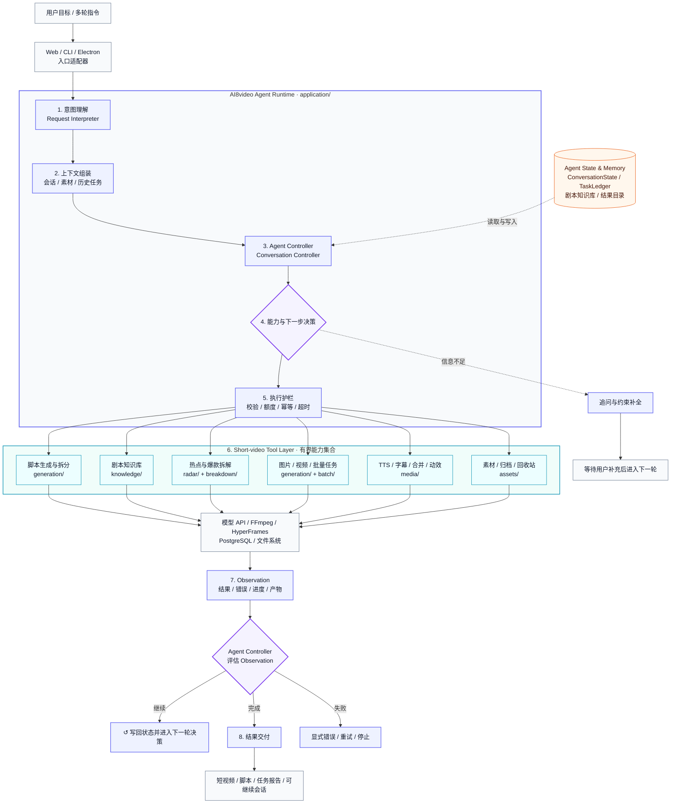
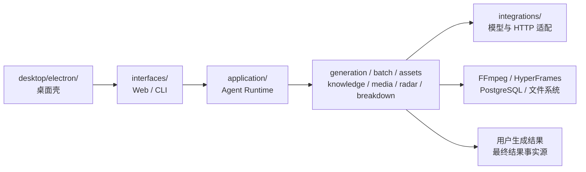

# AI8video Agent 架构与边界

AI8video 是面向短视频生产的自研有界垂直 Agent，也是一个本地有界单体：一个 Python 进程承载意图理解、上下文状态、工作流决策、能力调用、观察反馈和媒体处理，Web、CLI 与 Electron 只负责接入。源码统一放在 `src/ai8video/`，避免根目录散落模块和同一能力存在多个入口实现。

AI8video 的 Agent 身份来自完整运行闭环，而不是某个第三方框架：项目在 `application/` 中实现自己的 Agent Runtime，并把自主决策限制在短视频生产能力集合内。

## Agent 运行闭环



这个闭环表达的是当前真实行为：模型负责理解意图和结构化信息，`AI8VideoConversationController` 依据上下文选择内置能力，本地 Python 执行工具顺序与安全护栏，再把执行结果作为 Observation（观察）送回控制器。它不是无限自主循环；信息不足时追问用户，任务完成、失败或触发护栏时停止。

## 多 Agent 演进边界

当前已接入本地有界多 Agent 调度：

1. `generation_batches` 中的现有生成批次会同步为 `supervisor` 根任务，保持旧接口和运行行为兼容。
2. `agent_tasks`、`agent_task_edges` 和 `agent_task_events` 分别保存任务事实、DAG（有向无环图）依赖和不可变审计事件。
3. 新任务通过幂等键创建，执行器使用 CAS（比较并交换）版本抢占和续租，避免两个 worker 同时接管同一任务。
4. 租约过期只进入 `recovery_required`，不会盲目重放模型提交、视频生成或归档等有外部副作用的步骤。
5. Planner 和 Reviewer 已作为根任务的一层 Specialist Agent 接入；Reviewer 依赖 Planner，但两者都直接以 `supervisor` 为父任务，任务图深度固定为 1。
6. 当前 Specialist 只复用既有规划输出、后审核结果和确定性检查证据，不增加模型请求、不改变提示词或视频结果；任务账本故障采用 fail-open（失败开放），不能阻断真实生成。
7. 子任务快照只保存数量、状态、字段存在性和摘要哈希，不保存完整提示词、模型原始响应、URL 或绝对路径。
8. 每条独立视频后续仍可演进为并行 `VideoTask` Worker；FFmpeg、TTS、轮询和归档继续作为确定性工具，不包装成自治 Agent。
9. 单进程 `AgentTaskScheduler` 先取得本地并发容量再原子认领 SQLite 任务；取消中的 handler 在真实退出前继续占用槽位，避免突破并发上限。
10. 每次认领使用唯一 worker ID 作为 fencing（栅栏）令牌；续租和终态提交必须同时满足所有权、当前状态及租约未过期，迟到 worker 不能覆盖恢复后的结果。
11. 启动恢复默认拒绝自动重放；只有 handler 注册表明确标记为 `replay_safe` 的纯观察任务可以从 `recovery_required` 重新排队。模型调用、视频创建、媒体后处理和归档仍停留在人工对账边界。
12. 失败或取消的依赖会把尚未执行的下游任务收敛为 `cancelled`，不再永久停留在 queued。
13. 取消请求是 sticky（粘性）的：一旦进入 `cancel_requested`，迟到的成功或失败结果只能收敛为 `cancelled`，不能重新解锁依赖或进入重试。
14. 根任务和 Agent 子任务都采用 terminal first-wins（终态首次写入获胜）；任何迟到终态、结果、worker 或错误信息都不能覆盖首个终态事实。
15. 调度器关闭是一次性的完整状态迁移：关闭与入队按同一周期锁排序，账本持久化异常会显式记录但不能阻止 dispatcher、线程池和本机运行态停止；轮询周期必须短于心跳周期，心跳周期必须短于租约。
16. 多 Agent 调度不改写普通生成参数：视频数量、时长、并发方式和合并模式继续以用户请求与本机配置为准，不额外施加条数上限、固定时长或强制串行策略。

Planner 的真实视频规划结果与 Reviewer 的媒体审核影子证据均由单进程调度器登记，最大并发为 2，并在 Web 启动时完成安全恢复扫描。智能分集正式归属 Planner；真实生成根任务尚未迁移到该调度器。只有出现真实的进程隔离、故障域或独立扩缩容需求，才替换执行 transport，不先引入微服务或第三方通用 Agent 框架。

当前消息与用户可编辑业务提示词共同构成单次任务的内容真值。提示词改写和最终后审核必须合并两者全部能够共存的主题、主体、人物、产品、显式核心关键词、风格和镜头约束；主题保留门禁防止历史模板删掉当前输入，真正无法共存的直接矛盾才由当前消息处理。

## 工程分层



## 源码布局

```text
src/ai8video/
├── core/          产品身份、配置、路径和基础数据模型
├── application/   Agent Runtime：意图、上下文、决策、会话与应用门面
├── generation/    脚本拆分、生成流水线、任务与结果审核
├── batch/         批量任务、报告、告警、账本和守护进程
├── assets/        用户素材、生成结果、归档和回收站
├── knowledge/     剧本知识库、查询、重排和文本处理
├── media/         FFmpeg、配音、字幕、合并与 HTML 动效
├── integrations/  文本、图片、视频模型及 HTTP 适配器
├── radar/         热点聚合与摘要
├── breakdown/     爆款视频拆解
└── interfaces/    Web、CLI 和演示入口

desktop/electron/  可选桌面壳
tests/             离线质量门禁，不进入运行包
```

## 强制依赖规则

1. `interfaces/` 可以依赖 `application/` 和具体功能模块；核心模块不得反向导入 `interfaces/`。
2. 跨功能的会话、配置、资产和批量用例优先通过 `application/facade.py` 暴露，CLI 不复制业务流程。
3. `core/` 只放稳定基础概念，不依赖业务领域、入口或外部系统。
4. 模型 API、FFmpeg、HyperFrames、PostgreSQL 和文件系统属于边界资源；失败必须显式返回真实错误，不伪造成功。
5. `用户文件夹/用户生成结果/` 是最终结果事实源；`temp/ai8video/` 只保存可丢弃、可重建的过程状态。
6. 产品显示名统一为 `AI8video`，Python 包和命令统一为 `ai8video`，环境变量统一为 `AI8VIDEO_`。旧名称只允许存在于迁移兼容代码中，读取后只写新名称。
7. `ai8video_cli/`、`frontends/` 和 `tools/ai8video/` 已移除，不得重新建立第二套入口或核心包。

上述依赖方向、旧入口残留和重复核心路由由 `tests/test_ai8video_architecture.py` 持续检查。

## 模块职责

| 区域 | 负责 | 不负责 |
|---|---|---|
| `interfaces/` | HTTP、命令参数、输入校验、序列化、进程启动 | 核心状态与业务规则 |
| `application/` | Agent Runtime、会话、请求解释、能力决策和跨领域编排 | 页面样式、模型协议细节 |
| `generation/`、`batch/` | 生成与批量任务生命周期 | 浏览器或桌面窗口 |
| `assets/`、`knowledge/`、`media/`、`radar/`、`breakdown/` | 各自领域能力 | 跨领域总流程 |
| `integrations/` | 外部模型和 HTTP 协议适配 | 产品交互决策 |
| `desktop/electron/` | 桌面窗口和 Python 服务拉起 | 短视频业务实现 |

当前保持单进程、自研 Agent Runtime 和轻量 CLI；除非出现独立部署、独立扩缩容或明确的多实现需求，不引入微服务、第三方通用 Agent 框架或额外抽象层。
